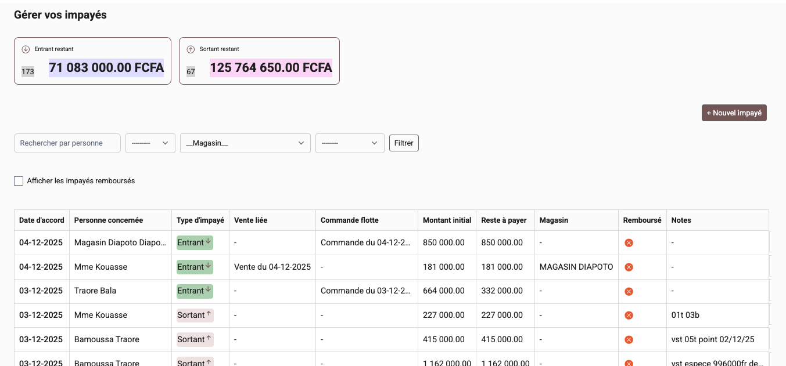

# 🚚 QuickStock — Custom ERP for Sales & Logistics Operations

**QuickStock** is a fully customized ERP built with **Python/Django**, designed exclusively for a logistics and distribution company operating in the construction materials sector. Unlike generic ERP systems, QuickStock is tailored to the company’s internal workflows, operational constraints, and day-to-day processes, making it a precise fit for a highly specialized business environment.

The company operates a large fleet of vehicles delivering products such as cement and reinforcing steel. QuickStock centralizes these logistics activities through a dedicated **Fleet Management module**, covering vehicle records, trip tracking, shipment follow-up, and automated order voucher generation.

To support the company’s financial workflow, QuickStock includes a **Debt Management module** for monitoring client balances, outstanding payments, and credit risks across multiple sales points.

Its **Sales Management module** provides tools for handling product entries, multi-site inventory tracking, stock movements, and resale operations, ensuring complete visibility from warehouse to customer delivery.

QuickStock is an actively maintained system: new features are continuously added, existing modules evolve with operational needs, and the entire stack is kept up to date to ensure long-term reliability.

Built as a dedicated solution, QuickStock enables the company to manage logistics, sales, and finances within a single, cohesive platform specifically crafted for its niche operational reality.

---

Full demo
👉 http://demo.quickstock.tech
